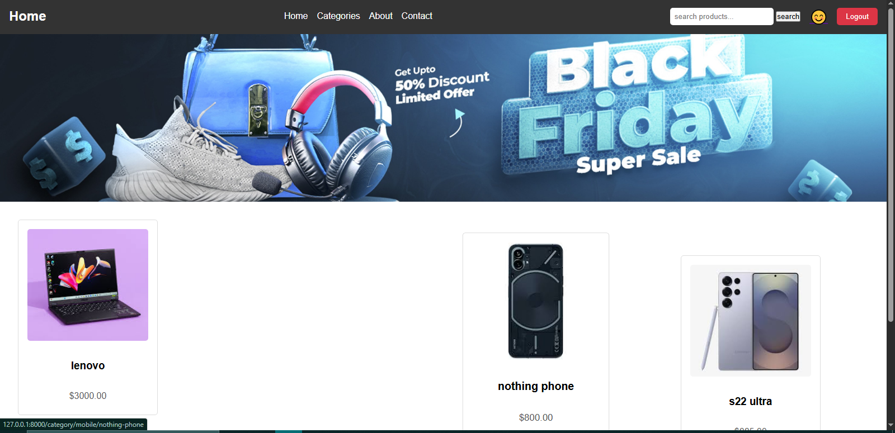
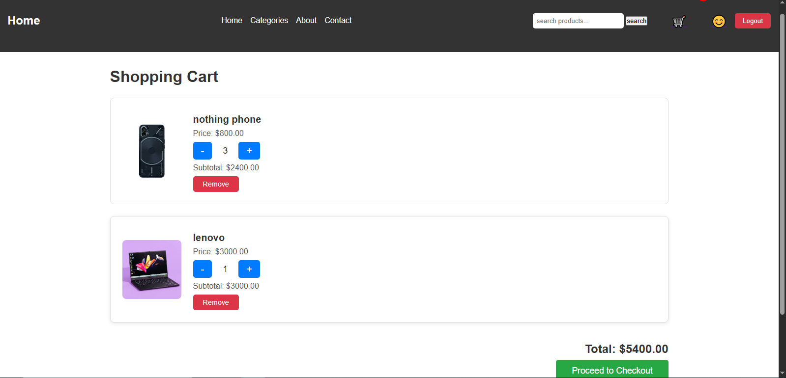
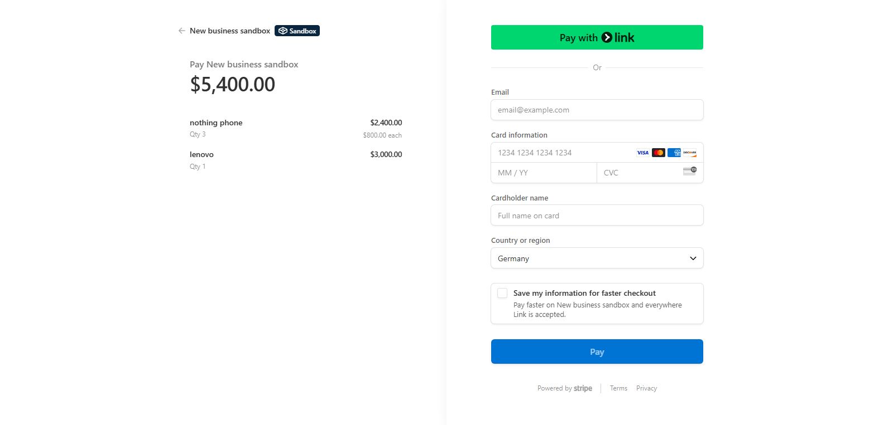

# Online Store

## Introduction
This project is an **e-commerce web application** built with **Django** for portfolio purposes. The main goal is to provide a fully functional online store with secure user authentication, product management, shopping cart, and payment processing using **Stripe**. The application features a user-friendly admin panel for managing users and orders, and a responsive front-end styled with **Tailwind CSS**.



---

## Features
- **User Authentication**:
  - Registration, login, and logout with a custom user model.
  - Restricted access to checkout and-payment processing for authenticated users only.
- **Product Management**:
  - Browse products, add to cart, and manage cart items.
- **Order Management**:
  - Create and track orders with details like order number, email, address, and status.
  - Display order items (products, quantities, prices) in the admin panel and user interface.
- **Payment Processing**:
  - Secure payments via **Stripe Checkout**.
  - Store payment details (e.g., Stripe payment ID, amount) in the database.
- **Admin Panel**:
  - Comprehensive interface to manage users, orders, and payments.
  - Inline display of order items and user orders in the admin panel.
- **Security**:
  - Environment variables for sensitive data (e.g., Stripe keys) using `python-dotenv`.
  - Protection against secret exposure with `.gitignore` and GitHub Secret Scanning.
- **Responsive Design**:
  - Front-end styled with **Tailwind CSS** for a modern, mobile-friendly experience.

---

## Technologies Used
- **Programming Language**: Python 3
- **Web Framework**: Django 4.2+
- **Payment Processing**: Stripe
- **Front-end Styling**: Tailwind CSS
- **Database**: SQLite (for development)
- **Environment Variables**: python-dotenv
- **Version Control**: Git with GitHub integration

---

## Project Structure
- `accounts/`: User authentication and management (custom `User` model, signup, signin, logout).
- `payments/`: Order and payment processing with Stripe integration (`Order`, `OrderItem`, `Payment` models).
- `shop/`: Product and cart management (`Product`, `Cart`, `CartItem` models).
- `templates/`: HTML templates for front-end (e.g., `signup.html`, `signin.html`, `checkout.html`, `success.html`).
- `static/`: Static files (CSS, JavaScript, images).

---

## Installation and Setup
1. Clone the repository:
   ```bash
   git clone https://github.com/arvinashoori/online-store.git
   cd online-store
   ```
2. Create and activate a virtual environment:
   ```bash
   python -m venv venv
   source venv/bin/activate  # On Windows: venv\Scripts\activate
   ```
3. Install dependencies:
   ```bash
   pip install -r requirements.txt
   ```
4. Set up environment variables in `.env`:
   ```plaintext
   STRIPE_SECRET_KEY=your_stripe_secret_key
   STRIPE_PUBLISHABLE_KEY=your_stripe_publishable_key
   SECRET_KEY=your_django_secret_key
   DEBUG=True
   ```
5. Apply migrations:
   ```bash
   python manage.py makemigrations
   python manage.py migrate
   ```
6. Run the development server:
   ```bash
   python manage.py runserver
   ```

Access the application at `http://127.0.0.1:8000`.

---

## Usage
- **Admin Panel**: Manage users, orders, and payments at `http://127.0.0.1:8000/admin/`.
- **User Actions**:
  - Register: `/accounts/signup/`
  - Login: `/accounts/signin/`
  - Logout: `/accounts/logout/`
  - Checkout: Add products to cart and proceed to payment (requires login).
- **Payment**: Complete purchases via Stripe Checkout, with order details saved in the database.

---

## Example Workflow
1. **Register a User**:
   - Navigate to `/accounts/signup/` and create an account.
   - Example: Username: `arvin`, Email: `arvin@example.com`, Password: `A12345678a@`.
2. **Login**:
   - Go to `/accounts/signin/` and log in with your credentials.
3. **Add to Cart**:
   - Browse products, add them to your cart, and proceed to checkout.
4. **Checkout**:
   - Enter email and address in the checkout form.
   - Complete payment via Stripe.
5. **View Orders**:
   - Admins can view all orders and their items in the admin panel (`/admin/payments/order/`).
   - Users can see order confirmation after payment (`/payments/success/`).

---

## Screenshots



---

## Contributing
1. Fork the repository.
2. Create a new branch: `git checkout -b feature-name`.
3. Make changes and commit: `git commit -m "Add feature"`.
4. Push to your branch: `git push origin feature-name`.
5. Create a pull request.

---

## Author
**Arvin Ashoori**

## Contact
- **GitHub**: [arvinashoori](https://github.com/arvinashoori)
- **Email**: [arvin.ashoori@gmail.com]
- **Tg**: [@arvinashoori]